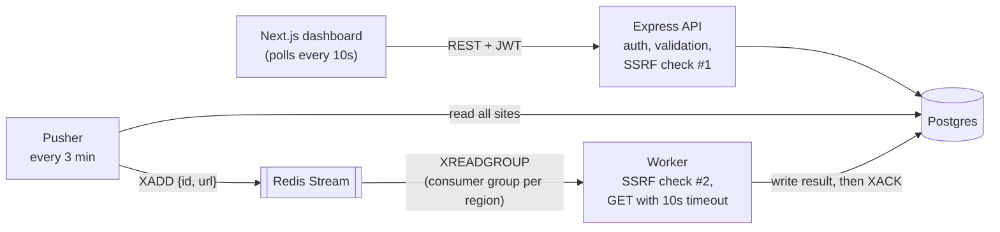

# StackPulse

An uptime monitor. You add a URL, a scheduler puts it on a Redis Streams queue every 3 minutes, and worker processes check it and record whether it was **Up**, **Down** or **Unknown**, how long it took, and why it failed.

Built with TypeScript on Bun: an Express API, a Next.js dashboard, Postgres through Prisma, and Redis Streams between the scheduler and the workers.

## Where this came from

StackPulse started as a course reference implementation of a BetterUptime-style monitor (the course roadmap is in [`steps.png`](./steps.png)). That base is the [first commit](https://github.com/dravall/StackPulse/commit/63067e3). It ran, but before building on it I reviewed every file the way I'd review a pull request. Everything after the first commit is my work, and each fix is its own commit, so you can check any of it.

### What I changed from the course base

| Problem in the base | What I did | Commit |
|---|---|---|
| Passwords were stored in plain text and compared with `!==` | bcrypt (cost 12) on signup, `bcrypt.compare` on signin | [`6c70b26`](https://github.com/dravall/StackPulse/commit/6c70b26) |
| Login tokens never expired | JWTs expire after 1 hour | [`6c70b26`](https://github.com/dravall/StackPulse/commit/6c70b26) |
| The raw `Authorization` header was passed to `jwt.verify`, and every failure returned 403 | Standard `Bearer` parsing; 401 with separate "expired" and "invalid" errors | [`bf54270`](https://github.com/dravall/StackPulse/commit/bf54270) |
| The worker fetched any URL a user saved, including `localhost` and `169.254.169.254` (SSRF) | A shared `url-safety` package resolves the hostname and rejects private, loopback, link-local, CGNAT and reserved addresses. It runs when the URL is saved and again right before each check, and redirects are disabled. | [`1d308f4`](https://github.com/dravall/StackPulse/commit/1d308f4), [`ca30f91`](https://github.com/dravall/StackPulse/commit/ca30f91) |
| `POST /website` only checked that a `url` field existed | Zod validation: a real URL, `http`/`https` only, not internal | [`9c76229`](https://github.com/dravall/StackPulse/commit/9c76229) |
| No rate limiting, no CORS policy, `dotenv` loading commented out | Rate limit on signup/signin, a CORS allowlist, and Zod-validated env vars in every process | [`9c76229`](https://github.com/dravall/StackPulse/commit/9c76229) |
| No timeout on the HTTP check, so one slow site could stall a worker indefinitely | 10 second timeout | [`e970da8`](https://github.com/dravall/StackPulse/commit/e970da8) |
| Every failure was recorded as Down | An HTTP error is Down with the status (`HTTP 503`); a network or timeout failure is Unknown with the error code | [`ca30f91`](https://github.com/dravall/StackPulse/commit/ca30f91) |
| The Redis consumer group was never created, so a worker crashed on a fresh Redis (`NOGROUP`) | Idempotent group bootstrap (`MKSTREAM`, ignore `BUSYGROUP`) | [`eaa309f`](https://github.com/dravall/StackPulse/commit/eaa309f) |
| `XREADGROUP` had no `BLOCK`, so an idle worker spun in a tight loop against Redis | Blocking reads (`BLOCK 5000`) | [`eaa309f`](https://github.com/dravall/StackPulse/commit/eaa309f) |
| One Redis round trip per enqueued site, and acks that were never awaited | Pipelined `XADD` and `XACK`, awaited before the next read | [`eaa309f`](https://github.com/dravall/StackPulse/commit/eaa309f), [`e970da8`](https://github.com/dravall/StackPulse/commit/e970da8) |
| No cascade deletes, no uniqueness on a user's URLs, no index for "latest check" queries | Cascades, `@@unique([user_id, url])` (duplicates return 409), `@@index([website_id, createdAt])`, and an `error_message` column | [`dd7bb04`](https://github.com/dravall/StackPulse/commit/dd7bb04), [`9c76229`](https://github.com/dravall/StackPulse/commit/9c76229), [`b767129`](https://github.com/dravall/StackPulse/commit/b767129), [`521ca29`](https://github.com/dravall/StackPulse/commit/521ca29) |
| Only create and read-one existed for websites, and a missing site returned 409 | List with cursor pagination, update and delete, all scoped to the owner; missing sites return 404 | [`6c70b26`](https://github.com/dravall/StackPulse/commit/6c70b26) |
| The negative tests called `expect(false, "...")` with no matcher inside `try/catch`, so they could never fail | Assertions that check the actual status codes, plus new CRUD, cross-user and SSRF tests | [`bf54270`](https://github.com/dravall/StackPulse/commit/bf54270), [`bb507d0`](https://github.com/dravall/StackPulse/commit/bb507d0) |
| `apps/web` was the default Next.js template | A working dashboard (below) | [`c6bea69`](https://github.com/dravall/StackPulse/commit/c6bea69) |

## How it works



The work is split across processes on purpose. The API never visits a monitored site, so a slow site can't slow down the dashboard. The pusher only decides *what* needs checking; workers do the slow network part and can be scaled separately. Workers that share a region share a consumer group, so Redis splits the jobs between them with no coordination code. Workers in different regions each get every job.

| Part | What it does |
|---|---|
| `apps/api` | REST API: `POST /user/signup`, `POST /user/signin`, `GET /websites`, `POST /website`, `GET /status/:websiteId`, `PATCH /website/:id`, `DELETE /website/:id`, `GET /health` |
| `apps/pusher` | Every 3 minutes, reads every website and adds `{id, url}` to the Redis Stream |
| `apps/worker` | Reads 5 jobs at a time, checks each URL, writes a `website_tick` row, then acknowledges the jobs |
| `apps/web` | Sign in/up; a sites table with status, response time and last check; add, edit and delete; error states for invalid URLs, duplicates (with an "Edit existing" shortcut), internal addresses and rate limits |
| `apps/tests` | Integration tests that run against a live API over real HTTP |
| `packages/store` | Prisma schema, migrations and region seed |
| `packages/redisstream` | Redis Streams wrapper: pipelined add/ack, blocking group reads, group bootstrap |
| `packages/url-safety` | The SSRF filter |

## Security notes

Implemented:
- bcrypt password hashing, 1 hour JWTs, and username/password length limits (passwords over 72 bytes are rejected rather than silently truncated by bcrypt)
- Every read and write is scoped to the owner inside the database query (`WHERE id = ? AND user_id = ?`), so another user's site behaves as if it doesn't exist (404)
- SSRF protection at save time and at check time, with redirects off
- 5xx responses return a generic message; details are only logged
- Rate limiting on signup and signin; a CORS allowlist; `X-Powered-By` disabled

Known limitations, deliberately listed:
- **DNS rebinding.** The SSRF check and the actual request resolve DNS separately, so a short-TTL record could change in between. The fix is to connect to the exact IP that was validated.
- **Token storage.** The JWT lives in `localStorage`, which any XSS could read. React escapes all rendered content and nothing renders raw HTML, but httpOnly cookies would be stronger. There are no refresh tokens or revocation.
- **Rate limiting.** It's in-memory per process and keyed by IP plus username, so it resets on restart and doesn't stop someone rotating usernames. Website writes aren't rate limited.

## Running it locally

Requires [Bun](https://bun.sh) and Docker.

```bash
docker compose up -d   # Postgres 16 + Redis 7, bound to 127.0.0.1 only
bun install
```

Copy each `.env.example` to `.env`. The defaults work with Docker Compose; set `JWT_SECRET` to a long random string (for example `openssl rand -hex 48`).

```bash
cp packages/store/.env.example packages/store/.env
cp apps/api/.env.example apps/api/.env
cp apps/worker/.env.example apps/worker/.env
cp apps/pusher/.env.example apps/pusher/.env
cp apps/web/.env.example apps/web/.env
```

| Variable | Used by | Notes |
|---|---|---|
| `DATABASE_URL` | store, api, worker, pusher | Postgres connection string |
| `JWT_SECRET` | api | Signs auth tokens |
| `PORT` | api | Defaults to `3001` |
| `FRONTEND_URL` | api | CORS allowlist; defaults to `http://localhost:3000` |
| `REGION_SLUG` | worker | A region name from the `region` table, e.g. `us-east` |
| `WORKER_ID` | worker | Unique name for this worker within its region |
| `NEXT_PUBLIC_API_URL` | web | Where the dashboard reaches the API; defaults to `http://localhost:3001` |

Create the tables and seed the regions (`us-east`, `eu-west`, `ap-south`):

```bash
cd packages/store
bunx prisma migrate dev
bunx prisma db seed
```

Then start each process in its own terminal:

```bash
cd apps/api && bun run index.ts
cd apps/worker && bun run index.ts
cd apps/pusher && bun run index.ts
cd apps/web && bun dev
```

Open http://localhost:3000, sign up, and add a URL. The pusher's first sweep runs on startup and then every 3 minutes. To simulate another region, start a second worker with `REGION_SLUG=eu-west` and a different `WORKER_ID`.

## Tests

16 integration tests (`bun:test` + axios) run against a live API, not mocks. They cover signup/signin validation and wrong passwords, website creation and validation, rejection of `169.254.169.254`, the missing-auth-header case, list/update/delete, and cross-user access: another user's site returns 404 for read, update and delete, and never shows up in their list.

With the API running:

```bash
cd apps/tests
bun test
```

The tests create real users and sites in your local database and don't clean them up.

## Status and next steps

This is a work in progress. What it doesn't do yet:

- **Alerting.** It records outages but doesn't notify anyone.
- **History.** The API only returns each site's latest check, so there are no charts.
- **Crash recovery.** If a worker dies after reading jobs but before acknowledging them, nothing reclaims them (`XAUTOCLAIM` isn't used yet), and the stream is never trimmed (`MAXLEN`).
- **Pusher scaling.** The pusher loads every site on each sweep, which is fine for hundreds of sites but not for large numbers.
- **Deployment.** The Redis client always connects to `localhost:6379`, so a `REDIS_URL` setting is needed before the app can be deployed. There's no CI yet.

The next items I'm working on are crash recovery and stream trimming, then alerting.
